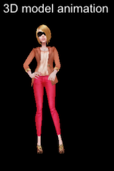

## Sprite3D
Just like 2D games, 3D games also have `Sprite` objects. `Sprite` objects are a
core foundation of any game. One of the main differences between `Sprite` and
`Sprite3D` is `Sprite3D` objects have 3 axes it can be positioned on:
__x__,  __y__ and __z__. `Sprite3D` works in many ways just like a normal `Sprite`.
It is easy to load and display a `Sprite3D` object:


auto sprite = Sprite3D::create("boss.c3b"); //c3b file, created with the FBX-converter
sprite->setScale(5.f); //sets the object scale in float
sprite->setPosition(Vec2(200,200)); //sets sprite position
scene->addChild(sprite,1); //adds sprite to scene, z-index: 1


This creates and positions a `Sprite3D` object from `.c3b` file. Example:

Now, let's rotate the model in a loop. For this we will create an action and run
it:


//rotate around the X axis
auto rotation = RotateBy::create(15, Vec3(0, 360, 0));
//our sprite object runs the action
sprite->runAction(RepeatForever::create(rotation));


To set an anchor point on the `Sprite` or `Sprite3D` use:


sprite->setAnchorPoint(Point(0.0f,0.0f));


### Attaching 3D models to Sprite3D objects.
Recall above that a 3D model is a collection of __meshes__. You can attach 3D models
to other 3D models to create rich effects. An example would
be adding a weapon to a character. To do this you need to find the attachment
point where the weapon is to be added. For this use the __getAttachNode(attachment_point_name)__
function. And then we just add the new model to the attachment point as a child
with __addChild()__. You can think of this as combining multiple simpler 3D models
to create more complex models. For example adding a model to a `Sprite3D` object:


auto sp = Sprite3D::create("axe.c3b");
sprite->getAttachNode("Bip001 R Hand")->addChild(sp);


### Swap 3D Model
When doing 3D development you might want to make dynamic changes to your model.
Perhaps due to power-ups, costume changes or visual cues to notify the user about
status changes of your model. If your 3D model is comprised from __meshes__ you can
access the __mesh data__ using __getMeshByIndex()__ and __getMeshByName()__. Using
these functions it is possible to achieve effects like swapping a weapon or clothing
for a character. Let's take a look at an example of a girl wearing a coat:

We can change the coat that the girl is wearing by changing the visibility of
the __mesh__ objects we are using. The following example demonstrates how to do
this:


auto sprite = Sprite3D::create("ReskinGirl.c3b");

// display the first coat
auto girlTop0 = sprite->getMeshByName("Girl_UpperBody01");
girlTop0->setVisible(true);

auto girlTop1 = sprite->getMeshByName("Girl_UpperBody02");
girlTop1->setVisible(false);

// swap to the second coat
girlTop0->setVisible(false);
girlTop1->setVisible(true);


The results:

