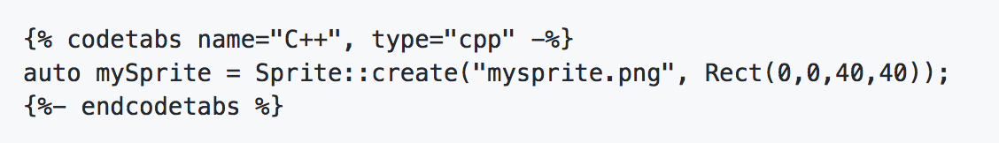

## 프로젝트에 기여하는 방법

### 문서로 기여하는 방법
우리는 항상 우리 문서에 기여하는 것을 환영한다.

  - Fork our [docs repo](https://github.com/cocos2d/cocos2d-x-docs)
  - __en/__ is for English contributions, __zh/__ is for 中文 contributions.
  - 코드 블럭들은 올바르게 동작하기 위해 반드시 특별한 코드로 감싸야한다:
    - C++ only code block:
      
      auto mySprite = Sprite::create("mysprite.png", Rect(0,0,40,40));
      

      

  - `gitbook build` 와 `gitbook serve` 를 사용해 변경된 부분을 테스트 해라. 몇 개의 브라우저에서 테스트 해라.
  - 변경한 부분을 *pull request* 하면 검토하고 반영하겠다.

### cocos2d-x 에 기여하기

#### 일반적인 질문
다음을 통해 일반적인 질문을 할 수 있다:

  -   Forum (preferred way): http://discuss.cocos2d-x.org/
  -   Weibo: http://t.sina.com.cn/cocos2dx
  -   Twitter: http://www.twitter.com/cocos2dx

#### 버그 보고
[Issue Tracker](https://github.com/cocos2d/cocos2d-x/issues) 이용해 버그를 보고해달라.

버그를 보고하는 방법:

  - GitHub에 새로운 이슈를 등록한다 [here](https://github.com/cocos2d/cocos2d-x/issues/new)
  - 버그를 재현하기 위해 필요한 모든 정보를 추가한다.
    - 엔진 버전
    - 버그 재현 단계
    - 일부 슈도코드(의사코드)
    - 필요한 경우 리소스 링크

#### 패치 제출
만약 코드로 기여하기 원한다면 다음 스텝을 따르라:

(만약 당신이 깃 또는 깃허브 처음한다면, [Pro Git](http://progit.org/book/) 중  [프로젝트에 기여하기:작거나/큰 공용 프로젝트](http://progit.org/book/ch5-2.html#public_small_project) 를 참고하라  )

  -   깃허브에서 cocos2d-x의 최종 개발 브랜치를 다운로드 받는다:
    ```sh
    $ git clone git://github.com/cocos2d/cocos2d-x.git
    $ cd cocos2d-x
    $ git checkout v3
    $ ./download-deps.py
    $ git submodule update --init
    ```
  -   최근에 다운로드한 저장소에 변경 사항을 적용한다
  -   개인 저장소에 변경 사항을 커밋한다
  -   당신의 패치를 새로운 브랜치에 생성한다: `$ git checkout -b my_fix_branch`
  -   개인 공용 저장소에 새로운 브랜치를 푸쉬한다
  -   “cocos2d” 사용자에게 “pull request” 를 전송한다
  -   만약 _완료_ 된다면 아래 정의를 참조하라
  -   _Releases_ 는 규칙을 따라야한다. 아래의 정의를 참조하라

#### _완료_ 배치만 병합된다.
패치는 _완료_ 되어야한다. 그것의 의미는:

  -   C++ 코드는 [Cocos2d C++ Coding Style](https://github.com/cocos2d/cocos2d-x/blob/v3/docs/CODING_STYLE.md) 을 따라야한다
  -   Python 코드는 [PEP8 guidelines](https://www.python.org/dev/peps/pep-0008) 을 따라야한다
  -   패치는 설명이 있어야한다
  -   해당하는 경우 테스트 케이스를 포함한다 
  -   해당하는 경우 단위 테스트를 포함한다
  -   지원되는 모든 플랫폼에서 테스트해야한다. 지원되는 모든 플랫폼에서 테스트할 수 없다면, 우리에게 알려달라.
  -   성능을 저하시키면 안된다
  -   테스트 케이스를 깨드리면 안된다 
  -   지속적인 통합 빌드를 깨드리면 안된다
  -   하위 호환성을 깨뜨리면 안된다 
  -   경고 없이 컴파일 되야 한다 
  -   새로은 API는 cocos2d-x 사용자가 **사용하기 쉽고**, **익숙한** 방식으로 제공해야한다
  -   코드는 **확장이 쉽고** **유지보수** 가 편해야한다
  -   문서를 있어야한다: C++ API 문서는 Doxyge 문자열을 사용해서 만들고, README.md 파일에는 해당 툴 사용법이 있어야한다
  -   효율적이어야한다 (빠르고 적은 메모리를 요구 해야 한다)
  -   새로운 코드가 기존 코드를 손상시키지 않는 한 중복된 코드는 없어야한다
  -   주요 구성 요소를 다시 생성하는 패치는 다음 주요 버전에만 병합됩니다.

#### cocos2d-x 홍보하기 
당신의 게임에 cocos2d-x의 로고 사용하여 cocos2d-x를 홍보해주거나, cocos2d-x에 기부할 수 있도록 언급해달라.

#### 소문을 퍼뜨려라!
당신이 Cocos2d-x 에 대해 언급하는 것으로도 도울 수 있다. 그렇게 해주면 정말 고맙겠다.

  * Talk about us on Facebook! Our [__Facebook Page__](https://www.facebook.com/cocos2dx/)
  * Tweet, Tweet! Our [__Twitter__](https://twitter.com/cocos2dx)
  * Read our [__Blog__](http://blog.Cocos2d-x.org/) and promote it on your social media.
  * Become a [__Regional Coordinator__](http://discuss.Cocos2d-x.org/t/we-need-regional-coordinators/24104)
