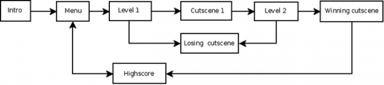

## Director
Cocos2d-x는 영화에서와 같이 `Director`의 개념을 사용한다. `Director`는 운영 흐름을 관리하고 필요한 작업자에게 무엇을 해야 할지를 알려준다. 스스로를 _제작 책임자_ 라고 생각하고 `Director`에게 뭘 해야하는 말하라! `Scene`의 교체 및 전환을 관리하는 것은 `Director`의 흔한 업무 중 하나이다. `Director`는 코드의 어느 곳에서도 호출할 수 있는 공유된 단일 개체다. (실제로, 한번에 한 클래스의 인스턴스만 존재한다.)

여기 전형적인 게임 흐름의 예가 있다. `Director`는 당신의 게임에서 결정한 기준에 맞게 전환된다:

당신은 게임의 감독이다. 어떤 일이 언제 어떻게 일어날지 결정하고 책임져라!