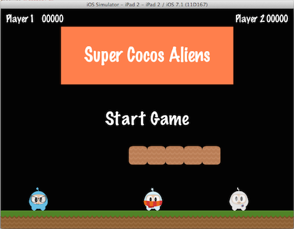

## 주요 구성
처음에는 너무 어려워 보일 수도 있지만, Cocos2d-x로 시작하는 것은 간단하다. 깊게 들어가기 전에 우리는 Cocos2d-x에서 사용되는 몇가지 개념을 이해해야만 한다. `Scene`과 `Node`, `Sprite`, `Menu` 그리고 `Action` 객체들이 Cocos2d-x의 핵심이다. 당신이 가장 좋아하는 게임을 보라, 그러면 여러분은 한 형태나 다른 형태로 이 모든 컴포넌트들을 보게 될 된다!

잠깐 살펴보자. 이것은 당신이 했을 법한 매우 인기 있는 게임과 약간 비슷하게 보일지도 모른다:

다시 한번 살펴보자. 스크린 샷을 분할하고 이것을 만드는 데 사용되는 컴포넌트들을 식별해 보자:

모든 것이 Cocos2d-x와 같은 메뉴, 일부 스프라이트 및 레이블을 볼 수 있다. 당신 자신의 게임 디자인 문서를 몇 가지 살펴보고, 가지고 있는 컴포넌트들이 무엇인지 확인해보라. 아마도 일치하는 몇 가지 컴포넌트들이 있을 것이다.