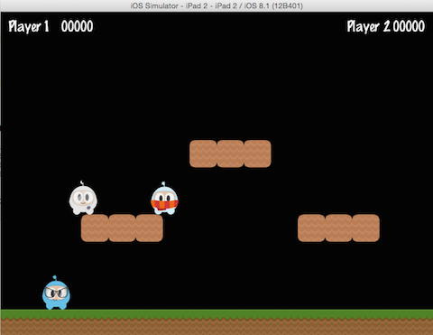

## Parent Child Relationship
Cocos2d-x는 __부모와 자식들__ 간의 관계를 사용한다. 이는 상위 노드의 속성과 변경 사항이 하위 노드에 적용됨을 의미한다. 하나의 `Sprite`와 그에 따른 자식 `Sprite`가 있다고 보자:

자식들과 함께 부모를 회전 시키는 것은 모든 자식들을 회전 시킬 수 있을 것이다:


auto myNode = Node::create();

// rotating by setting
myNode->setRotation(50);


회전과 마찬가지로, 부모의 크기를 변경하면 자식들도 변경될 것이다:


auto myNode = Node::create();

// scaling by setting
myNode->setScale(2.0); // scales uniformly by 2.0


__부모__ 에 대한 모든 변화가 __자식들__ 에게 전해지는 것은 아니다. __부모__ __anchor point__ 만 변경하면 변환 작업(*scale*, *position*, *rotate*, *skew*, etc...) 에 영향을 주고 자식들 위치 지정에는 영향을 주지 않습니다. 실제로 자식들은 항상 부모의 왼쪽 하단 모서리(0,0)에 추가됩니다.