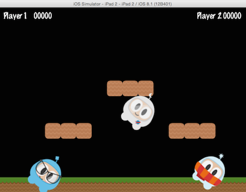

## Parent Child Relationship
Cocos2d-x는 __parent and child__ 간의 관계를 사용한다. 즉, 부모 노드의 속성 및 변경 사항이 해당 자식 노드에 적용된다. 하나의 `Sprite`와 그에 따른 자식 `Sprite`가 있다고 생각해보자:

자식의 경우, 부모의 회전을 변경하면 모든 자식들의 회전이 변경된다.:


auto myNode = Node::create();

// rotating by setting
myNode->setRotation(50);


회전과 마찬가지로, 부모의 크기를 변경하면 자식들의 크기도 조정된다:


auto myNode = Node::create();

// scaling by setting
myNode->setScale(2.0); // scales uniformly by 2.0


__부모__ 의 모든 변화가 __자식들__ 에게 전해지는 것은 아니다. __부모__ 의 __anchor point__ 를 변경하면 변환 작업(*크기*, *위치*, *회전*, *기울기*, 등)에만 영향을 주고 자식의 위치에는 영향을 주지 않는다. 실제로 자식은 항상 부모의 왼쪽 하단 모서리(0,0)에 추가되어진다.