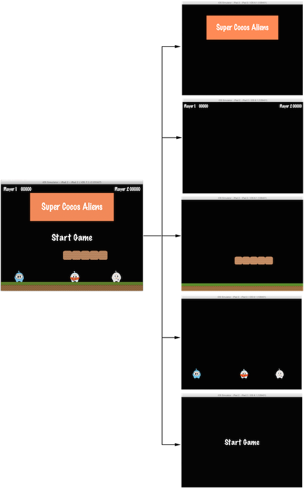

## Scene
게임에는 메인 메뉴와 몇 개의 레벨 장면 그리고 엔딩 장면이 필요할 것이다. 이 모든 것들을 어떻게 개별적인 조각으로 정리할까? 이럴 때 필요한게 `Scene`이다. 좋아하는 영화에 대해서 생각해보자. 장면이 분명하게 나누어 있거나 혹은 줄거리 별로 나누어 있는 것을 볼 수 있다. 만약 게임에도 동일하게 적용해보면, 아무리 게임이  단순하다고 해도 최소한 몇 개의 장면은 만들어 내야 한다. 

이전의 익숙한 이미지를 다시 한번 살펴 보자:

이 이미지는 주 메뉴이고 단일 `Scene` 으로 되어있다. 이 장면은 최종 결과물을 나타내기 위해 몇 개의 조각으로 구성되어 있다. 장면은 __renderer__ 로 그려진다. __renderer__ 는 스프라이트와 다른 객체들을 스크린에 렌더링하는 역할을 한다. 이 점을 더 잘 이해하기 위해 __scene graph__ 를 잠시 살펴 보자.

### Scene Graph
__scene graph__ 는 그래픽 장면을 배열하는 데이터 구조이다. __scene graph__ 은 트리에 있는 `Node` 객체를 포함한다. (__scene graph__ 라고 불리지만 실제로 __tree__ 구조를 나타낸다.)

이 이야기가 복잡해 보일 수 있다. Cocos2d-x가 어려운 일을 대신 해주는데, 왜 기술적인 세부 사항까지 신경을 써야 하는지를 묻고 있는 것이라고 확신한다. 렌더러가 어떻게 장면을 그렸는지 이해하는 것은 정말 중요하다.

게임에 노드, 스프라이트, 애니메이션을 한번 추가해 보자. 예상대로 그려지고 있는지 확인하고 싶을 거다. 하지만 예상대로 그려지지 않고 가장 중요한 스프라이트 객체가 배경에 숨겨져 버린다면 어떻게 하겠는가? 걱정마라, 단지 한 걸음 뒤로 물러나 종이에 그려진 장면 그래프를 살펴 보면, 단언컨대 실수를 쉽게 찾을 수 있을 것이다.

_Scene Graph_ 는 트리이기 때문에 __walk the tree__ 를 할 수 있다.  Cocos2d-x 는 __in-order walk__ 알고리즘을 사용한다. __in-order walk__ 는 왼쪽부터 이동하여 루트로 갔다가 오른쪽으로 이동한다. 트리의 오른쪽은 가장 나중에 렌더링 되므로, __scene graph__ 에 먼저 표시된다.

__scene graph__ 은 게임 장면을 세분화 하면 쉽게 입증된다:

다음과 같이 단순화된 트리로 표현할 수 있다:

또 다른 고려할 점은 __z-order__ 가 음수이면 요소들은 트리의 왼쪽에 있는 반면, __z-order__ 가 양수이면 요소들은 오른쪽에 있다는 것이다. 요소들을 정렬할 때 이 점을 고려해야한다. 물론 어떤 순서든 요소를 추가할 수 있으며, 사용자 정의가 된 _z-order_ 를 기준으로 자동으로 정렬할 수도 있다.

이 개념을 통해 우리는 `Scene`이 `Node` 객체의 집합이라고 생각할 수 있다. 위의 장면을 분석해 보면 __scene graph__ 가 `Scene` 을 나열 하기 위해 __z-order__ 를 사용한 것을 볼 수 있다:

왼쪽에 있는 `Scene`은 실제로 여러개의 `Node` 객체로 구성되어 있으며, 겹쳐 *쌓을* 수 있도록 각각 다른 __z-order__ 가 주어진다.

Cocos2d-x 에서는 *addChild()* 라는 API 호출을 사용하여 __scene graph__ 를 구축한다:


// Adds a child with the z-order of -2, that means
// it goes to the "left" side of the tree (because it is negative)
scene->addChild(title_node, -2);

// When you don't specify the z-order, it will use 0
scene->addChild(label_node);

// Adds a child with the z-order of 1, that means
// it goes to the "right" side of the tree (because it is positive)
scene->addChild(sprite_node, 1);

