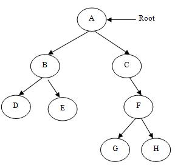
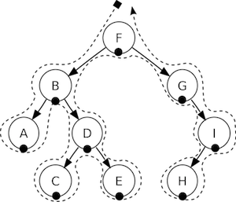

## Scene
당신은 당신의 게임에서 아마도 메인 메뉴, 몇 개의 레벨 그리고 마지막 장면을 원할 것이다. 이 모든 것들을 어떻게 개별적인 조각으로 정리할까요? 그래 `Scene`이다. 가장 좋아하는 영화에 대해서 생각할 때, 분명하게 장면으로 나누어 있거나 혹은 줄거리 별로 나누어 있는 것을 볼 수 있다. 만약 게임에도 동일하게 적용한다면, 우리는 게임이 아무리 단순하다 하더라도 최소한 몇 개의 장면을 만들어 내야 한다. 

이전의 익숙한 이미지를 다시 한번 살펴 보자:

이 이미지는 주 메뉴이고 단일 `Scene` 으로 되어있다. 이 장면은 최종 결과를 주기 위해 모두 함께 맞추어진 몇 개의 조각으로 만들어져 있다. 장면은 __renderer__ 에서 그려진다. __renderer__ 스프라이트를 렌더링 하는 역할을 하며 다른 물체들도 스크린에 나타납니다. 이 점을 더 잘 이해하려면 __scene graph__ 에 대해 잠시 이야기해야 합니다.

### Scene Graph
__scene graph__ 은 그래픽 장면을 배열하는 데이터 구조이다. __scene graph__ 은 트리 안에 `Node` 객체를 포함한다. (맞다, __scene graph__ 라고 불리지만 실제로 __tree__ 구조를 나타낸다. )

이 이야기가 복잡해 보일 수 있다. Cocos2d-x가 여러분을 힘들게 한다면 왜 이 기술적인 세부 사항에 대해 신경을 써야 하는지를 묻고 있는 것이라고 확신한다. 렌더러가 장면을 어떻게 그렸는지 이해하는 것이 정말 중요하다.

게임에 노드, 스프라이트, 애니메이션을 추가하자, 예상대로 그려지고 있는지 확인하고 싶을 거다. 하지만 예상대로 그려지지 않는다면? 스프라이트가 배경에 숨겨지고, 가장 중요한 객체가 되기를 원한다면 어떻게 하시겠습니까? 별거 아니다. 단지 한 걸음 뒤로 물러나서 종이에 그려진 장면 그래프를 통해 실수를 쉽게 찾을 거라고 장담한다.

_Scene Graph_ 은 트리이기때문에 __트리 이동__ 을 할 수 있다.  Cocos2d-x 는 __in-order walk__ 알고리즘을 사용한다. __in-order walk__ 는 왼쪽부터 이동을 시작하고 루트로 갔다가 오른쪽으로 이동한다. 트리의 오른쪽이 가장 나중에 렌더링 되므로, __scene graph__ 에 먼저 표시된다.

__scene graph__ 은 게임 장면을 세분화해 보면 쉽게 입증된다:

다음과 같이 단순화 된 트리로 렌더링된다.:

또 다른 고려할 점은 __z-order__ 가 음수이면 요소들은 트리의 왼쪽에 있는 반면, __z-order__ 가 양수이면 요소들은 오른쪽에 있다는 것이다. 요소들을 정렬할 때 이 점을 염려해야한다. 물론 어떤 순서로든 요소를 추가할 수 있으며, 사용자 정의가 된 z-order_를 기준으로 자동으로 정렬할 수 있다.

이 개념을 바탕으로, 우리는 `Scene`이 `Node` 객체의 집합이 이라고 생각할 수 있다. 위의 장면을 분석해 보면서 __scene graph__가 `Scene` 을 레이아웃 하기 위해 __z-order__를 사용하는 것을 볼 수 있다:

왼쪽에 있는 `Scene`은 실제로 여러개의 `Node` 객체로 구성되어 있으며, *겹쳐져 쌓을 수* 있도록 각각 다른 __z-order__ 주어진다.

Cocos2d-x 에서는 *addChild()* 라는 API 호출을 사용하여 __scene graph__ 를 개발합니다:


// Adds a child with the z-order of -2, that means
// it goes to the "left" side of the tree (because it is negative)
scene->addChild(title_node, -2);

// When you don't specify the z-order, it will use 0
scene->addChild(label_node);

// Adds a child with the z-order of 1, that means
// it goes to the "right" side of the tree (because it is positive)
scene->addChild(sprite_node, 1);

