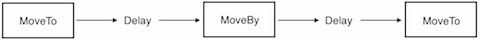

## Sequences and Spawns

화면에서 `Sprite` 객체를 움직이면 게임을 만드는데 필요한 모든 것을 갖게 된다. 그런가? 아직은 아니다. 여러 개의 __동작__ 을 실행하면 어떨까? 맞다, Cocos2d-x 에서는 좀 다르게 처리한다.

이 이야기는 `Sequence` 가 여러 개의 `Action` 객체들이 지정된 순서대로 실행되는 것이다. `Sequence` 가 반대로 실행되길 원하는가? 문제없다, Cocos2d-x 는 추가 작업없이 처리한다.

`Sprite` 가 차례대로 움직이는 `Sequence` 예제의 흐름을 살펴 보자:

이 `Sequence` 는 쉽게 만들 수 있다.


auto mySprite = Node::create();

// move to point 50,10 over 2 seconds
auto moveTo1 = MoveTo::create(2, Vec2(50,10));

// move from current position by 100,10 over 2 seconds
auto moveBy1 = MoveBy::create(2, Vec2(100,10));

// move to point 150,10 over 2 seconds
auto moveTo2 = MoveTo::create(2, Vec2(150,10));

// create a delay
auto delay = DelayTime::create(1);

mySprite->runAction(Sequence::create(moveTo1, delay, moveBy1, delay.clone(), moveTo2, nullptr));


이 예제를 순서대로 `Sequence` 를 실행하지만, 동시에 모든 지정한 __동작들__ 을 실행할 수는 없을까? Cocos2d-x는 `Spawn` 라고 불리우는 것 역시 지원한다. `Spawn` 는 모든 지정한 `동작` 객체들을 가져와 동시에 실행한다. 일부는 다른 것보다 더 오래 실행할 수 있기때문에 동시에 끝나지 않을 것이다.


auto myNode = Node::create();

auto moveTo1 = MoveTo::create(2, Vec2(50,10));
auto moveBy1 = MoveBy::create(2, Vec2(100,10));
auto moveTo2 = MoveTo::create(2, Vec2(150,10));

myNode->runAction(Spawn::create(moveTo1, moveBy1, moveTo2, nullptr));


`Spawn` 동작은 왜 필요한가? 더 이유가 있나? 물론! 만약 주인공이 파워업을 할 때 여러가지 __동작__ 을 한다면 어떻게 하겠는가? 최종보스를 잡는 것도 한 레벨을 끝내기 위해 필요한 여러가지 __동작__ 을 하는 것일지도 모른다.