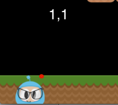

## Sprites
모든 게임은 `Sprite` 객체를 가지고 있고, 그것이 무엇인지 알지 못할 수도 있다. 스프라이트는 화면에서 움직이는 객체이다. 조작할 수 있다. 게임의 주인공은 아마도 스프라이트일 것이다. 모든 사물이 `스프라이트`가 아닌가요? 라고 생각한다는 것을 알고 있다. 아니다! 왜? 스프라이트는 움직일 때만 스프라이트이다. 만약 움직이지 않는다면 그것은 단지 `Node`일뿐이다.

위에서 본 이미지를 다시 살펴 보고, 스프라이트가 무엇이고 노드가 무엇인지 언급해보자:

모든 게임에서 스프라이트는 중요하다. 게임 제작사에서 작성한 어떤 종류의 이미지를 사용하여 만들어진 주인공을 아마도 가지고 있을 것이다. `Sprite`이다.

`Sprite`는 쉽게 만들 수 있고 설정 가능한 속성( __position__, __rotation__, __scale__, __opacity__, __color__ 등과 같은)을 가지고 있다.


// This is how to create a sprite
auto mySprite = Sprite::create("mysprite.png");

// this is how to change the properties of the sprite
mySprite->setPosition(Vec2(500, 0));

mySprite->setRotation(40);

mySprite->setScale(2.0); // sets both the scale of the X and Y axis uniformly

mySprite->setAnchorPoint(Vec2(0, 0));


각 속성을 설명하고, 스크린샷으로부터 이 장의 예제 코드를 살펴 보도록 하자:

다음을 사용하여 위치를 설정하는 경우 `mySprite->setPosition(Vec2(500, 0));`:

`스프라이트`의 위치가 원래 위치에서 우리가 지정한 새 위치로 바뀌었다.

이제 다음을 사용하여 새 회전을 설정할 경우 `mySprite->setRotation(40);`:

... you can see that the `Sprite` has been rotated to the new amount that was
specified.

If we now specify a new scale using `mySprite->setScale(2.0);`:

Again, we can see that the `Sprite` now has changed according to our code
changes.

Lastly, all `Node` objects (since a `Sprite` is a subclass of `Node`) have a
value for __anchor point__. We haven't talked about this yet, so now is a good
time. You can think of __anchor point__ as a way of specifying what part of the
sprite will be used as a base coordinate when setting the position of it.

Using the character from our example game, and setting the anchor point to
__0, 0__ using:


mySprite->setAnchorPoint(Vec2(0, 0));


would result in the lower left corner of our sprite being used as the basis for
any __setPosition()__ call. Let's see a few of these in action:

    

Take a look at the red dot in each picture. This red dot illustrates where
the anchor point is!

As you can see __anchor point__ is very useful when positioning `Nodes`. You
can even adjust the __anchor point__ dynamically to simulate effects in your
game.

We really can tweak just about every aspect of the `Sprite`. But, what if we
wanted to have these same types of changes occur in an automated, time
determined manner? Well, keep reading...
