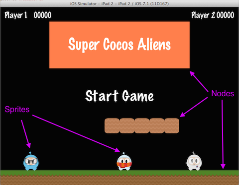

## Sprites
모든 게임은 `Sprite` 객체를 가지고 있고, 그것이 무엇인지 알지 못할 수도 있다. 스프라이트는 화면에서 움직이는 객체이다. 조작할 수 있다. 게임의 주인공은 아마도 스프라이트일 것이다. 모든 사물이 `스프라이트`가 아닌가요? 라고 생각한다는 것을 알고 있다. 아니다! 왜? 스프라이트는 움직일 때만 스프라이트이다. 만약 움직이지 않는다면 그것은 단지 `Node`일뿐이다.

위에서 본 이미지를 다시 살펴 보고, 스프라이트가 무엇이고 노드가 무엇인지 언급해보자:

모든 게임에서 스프라이트는 중요하다. 게임 제작사에서 작성한 어떤 종류의 이미지를 사용하여 만들어진 주인공을 아마도 가지고 있을 것이다. `Sprite`이다.

`Sprite`는 쉽게 만들 수 있고 설정 가능한 속성( __position__, __rotation__, __scale__, __opacity__, __color__ 등과 같은)을 가지고 있다.


// This is how to create a sprite
auto mySprite = Sprite::create("mysprite.png");

// this is how to change the properties of the sprite
mySprite->setPosition(Vec2(500, 0));

mySprite->setRotation(40);

mySprite->setScale(2.0); // sets both the scale of the X and Y axis uniformly

mySprite->setAnchorPoint(Vec2(0, 0));


각 속성을 설명하고, 스크린샷으로부터 이 장의 예제 코드를 살펴 보도록 하자:

다음을 사용하여 위치를 설정하는 경우 `mySprite->setPosition(Vec2(500, 0));`:

`스프라이트`의 위치가 원래 위치에서 우리가 지정한 새 위치로 바뀌었다.

다음을 사용하여 새 회전을 설정할 경우 `mySprite->setRotation(40);`:

... `Sprite` 가 지정된 새로운 크기로 회전되었음을 볼 수 있다.

다음을 사용하여 크기를 설정할 경우 `mySprite->setScale(2.0);`:

다시 한번, `Sprite` 가 변경된 코드에 맞게 변경되어진 것을 볼 수 있다.

마지막으로 모든 `Node` 객체는 (`Sprite` 도 `Node` 의 하위클래스이다) __anchor point__ 값을 가진다. 아직까지는 앵커 포인트에 대해 이야기하지 않았지만, 이제 이야기할 시간이 되었다. __anchor point__ 는 위치를 설정할 때 스프라이트의 부분이 기준 좌표로 사용되어 지정되는 방법이라고 생각할 수 있다.

예제 게임의 케릭터에 사용된 앵커포인트는 __0, 0__ 으로 설정되어 있다: 


mySprite->setAnchorPoint(Vec2(0, 0));


스프라이트의 좌측 아래 모서리가 선언된 __setPosition()__ 함수의 기준으로 사용된다. 몇가지 실제 작동하는 모습을 보자:

    

각각의 사진에 빨간점을 살펴보자. 빨간점은 앵커포인트를 보여준다.

보는 것과 같이 __anchor point__ 는 `Nodes` 의 위치를 지정할 때 매우 유용하다. 심지어 게임의 효과를 시뮬레이션하기 위해 동적으로 __anchor point__ 을 조정할 수도 있습니다.

우리는 정말로 스프라이트의 모든 면을 조정할 수 있습니다. 그런데 만약 동일한 유형의 변경이 시간 결정 방식에 따라 자동으로 발생되길 원한다면 어떻게해야하나? 그럼, 계속 읽어보라...