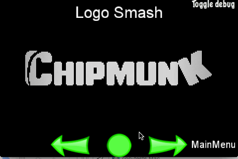

## Queries
Have you ever stood in one position and looked around? You see things __near__ to
you and __far__ from you. You can gauge how close things are to you. __Physics engines__
provide this same type of __spatial query__. `PhysicsWorld` objects currently support
__point queryies__, __ray casts__ and __rect queries__.

### Point Queries
When you touch something, say your desk, you can think of this as a __point query__.
They allow you to check if there are shapes within a certain distance of a point.
__Point queries__ are useful for things like __mouse picking__ and __simple sensors__.
You can also find the closest point on a shape to a given point or find the closest
shape to a point.

### Ray Cast
If you are looking around, some object within your sight is bound to catch your
attention. You have essentially performed a __ray cast__ here. You scanned until
you found something interesting to make you stop scanning. You can __ray cast__ at
a shape to get the point of first intersection. For example:


void tick(float dt)
{
    Vec2 d(300 * cosf(_angle), 300 * sinf(_angle));
    Vec2 point2 = s_centre + d;
    if (_drawNode)
    {
        removeChild(_drawNode);
    }
    _drawNode = DrawNode::create();

    Vec2 points[5];
    int num = 0;
    auto func = [&points, &num](PhysicsWorld& world,
        const PhysicsRayCastInfo& info, void* data)->bool
    {
        if (num < 5)
        {
            points[num++] = info.contact;
        }
        return true;
    };

    s_currScene->getPhysicsWorld()->rayCast(func, s_centre, point2, nullptr);

    _drawNode->drawSegment(s_centre, point2, 1, Color4F::RED);
    for (int i = 0; i < num; ++i)
    {
        _drawNode->drawDot(points[i], 3, Color4F(1.0f, 1.0f, 1.0f, 1.0f));
    }
    addChild(_drawNode);

    _angle += 1.5f * (float)M_PI / 180.0f;
}


### Rect Queries
__Rect queries__ provide a fast way to check roughly which shapes are in an area.
It is pretty easy to implement:


auto func = ->bool
{
    //Return true from the callback to continue rect queries
    return true;
}

scene->getPhysicsWorld()->queryRect(func, Rect(0,0,200,200), nullptr);


A few examples of using a __rect query__ while doing a *logo smash*:

