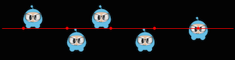
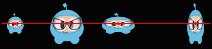

## 스프라이트 조작
`Sprite` 를 만든 후에 조작할 수 있는 다양한 특성에 접근할 수 있습니다.

다음과 같이 주어짐:


auto mySprite = Sprite::create("mysprite.png");


### 앵커포인트와 위치
__앵커 포인트__ 는 위치를 설정할 때 사용되어지는 `Sprite` 의 부분을 지정하여 설정하는 점이다. __앵커 포인트__ 는 변경할 
수 있는 속성에만 영향을 받는다. __scale__ 과 __rotation__, __skew__ 은 포함되고, __color__ 과 __opacity__ 는 빠져 있다. 
__앵커 포인트__ 는 좌측 아래인 좌표계를 사용한다. 즉, X와 Y 좌표 값을 지정할 때 왼쪽 하단 모서리에서 시작하는 걸로 
계산해야 한다는 뜻이다. 기본적으르 모든 `Node` 객체의 __앵커 포인트__ 는 (0.5, 0.5)의 기본값을 갖는다. 

다음과 같이 __앵커 포인트__ 를 쉽게 설정할 수 있다:


// DEFAULT anchor point for all Sprites
mySprite->setAnchorPoint(0.5, 0.5);

// bottom left
mySprite->setAnchorPoint(0, 0);

// top left
mySprite->setAnchorPoint(0, 1);

// bottom right
mySprite->setAnchorPoint(1, 0);

// top right
mySprite->setAnchorPoint(1, 1);


다음과 같이 시각적으로 표현할 수 있다:

###  앵커 포인트의 영향을 받는 스프라이트 속성
__앵커 포인트__ 사용은 변경 가능한 속성에만 적용된다. __scale__, __rotation__, __skew__ 이 포함된다.

#### 위치
__스프라이트__ 의 위치는 __앵커 포인트__ 의 영향을 받는다. 이 점을 위치 지정을 위한 시작점으로 사용되기 때문입니다. 
어떻게 발생되는지 시작적으로 살펴보자. 색상이 지정된 선과 이에 대한 _스프라이트_ 의 위치를 살펴보자.
__앵커 포인트__ 값이 변경되면 _스트라이트_ 의 값도 변경되는지 살펴보자. __앵커 포인트__ 값이 변경되면 다른 것들도 변경된
다는 것을 유의하자. 이를 확인하기 위해 `setPosition()` 를 사용하지 않았다.

여기 __anchor point__ 만을 가지고 위치를 설정할 수 다른 방법도 있다. 
`Sprite` 객체는 `setPosition()` 메소드를 이용해 설정 할 수 있다


// position a sprite to a specific position of x = 100, y = 200.
mySprite->setPosition(Vec2(100, 200));


#### 회전
__스프라이트__ 의 음수 또는 양수의 크기로 회전할 수 있다.
양수값은 `Sprite` 객체를 시계방향으로 회전 시키고, 반명 음수값은 `Sprite` 객체를 시계반대 방향으로 회전 시킨다.
기본값은 __0__ 이다.  


// rotate sprite by +20 degrees
mySprite->setRotation(20.0f);

// rotate sprite by -20 degrees
mySprite->setRotation(-20.0f);

// rotate sprite by +60 degrees
mySprite->setRotation(60.0f);

// rotate sprite by -60 degrees
mySprite->setRotation(-60.0f);


#### 크기
__스프라이트__ 의 x, y 각각 다르게하거나  같은 비율로 크기를 변경할 수 있다. 
기본값은 x와 y 둘다 1.0 이다.


// increases X and Y size by 2.0 uniformly
mySprite->setScale(2.0);

// increases just X scale by 2.0
mySprite->setScaleX(2.0);

// increases just Y scale by 2.0
mySprite->setScaleY(2.0);


#### 기울임
__스프라이트__ 의 x, y 각각 다르게하거나  같은 비율로 기울기를 변경할 수 있다.
기본값은 x와 y 둘다 0,0 이다


// adjusts the X skew by 20.0
mySprite->setSkewX(20.0f);

// adjusts the Y skew by 20.0
mySprite->setSkewY(20.0f);


### Sprite properties not affected by anchor point
There are a few properties of `Sprite` objects that are not affected by
__anchor point__. Why? Because they only change superficial qualities like __color__ and __opacity__.

#### Color
Changes the _sprite's_ color. This is done by passing in a `Color3B` object.
`Color3B` objects are __RGB__ values. We haven't encountered `Color3B` yet but
it is simply an object that defines an __RGB color__. An __RGB color__ is a 3 byte
value from 0 - 255. Cocos2d-x also provides pre-defined colors that you can pick
from. Using these will be a bit faster since they are pre-defined. A few examples:
`Color3B::White` and `Color3B::Red`.


// set the color by passing in a pre-defined Color3B object.
mySprite->setColor(Color3B::WHITE);

// Set the color by passing in a Color3B object.
mySprite->setColor(Color3B(255, 255, 255)); // Same as Color3B::WHITE


#### Opacity
Changes the _sprite's_ opacity by the specified value. An opaque object is not
transparent at all. This property expects a value from 0 to 255, where 255 means
fully opaque and 0 means fully transparent. Think: __zero opacity means invisible__,
and you'll always understand how this works. The default value is 255 (fully opaque).


// Set the opacity to 30, which makes this sprite 11.7% opaque.
// (30 divided by 256 equals 0.1171875...)
mySprite->setOpacity(30);


